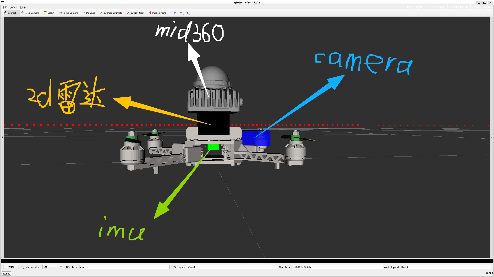
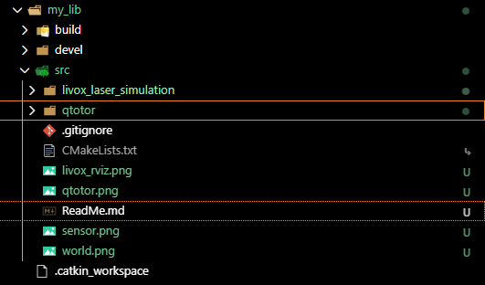
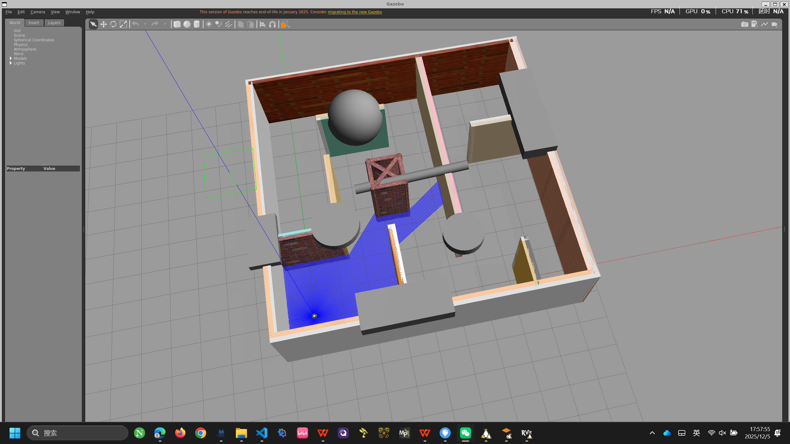
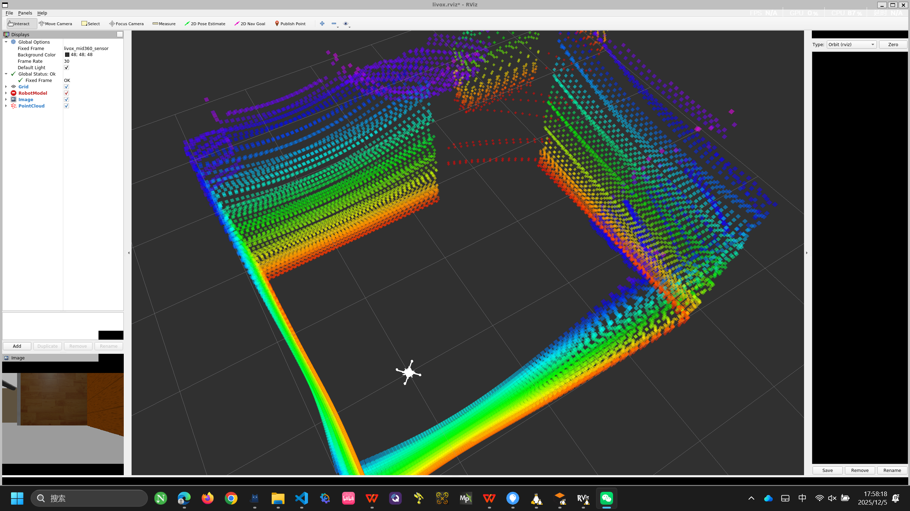
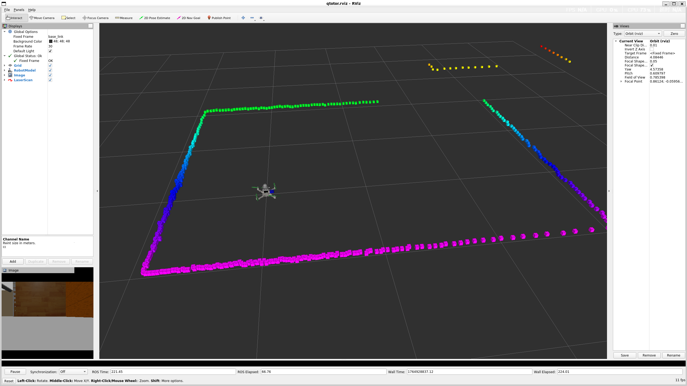
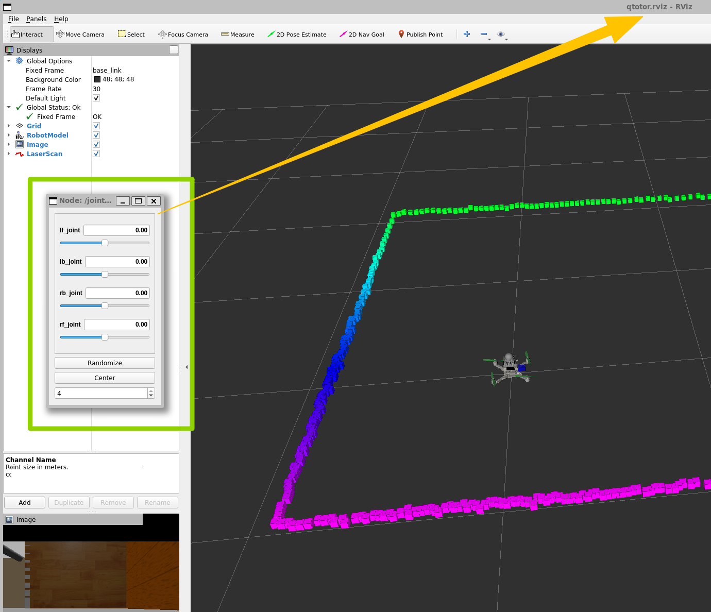
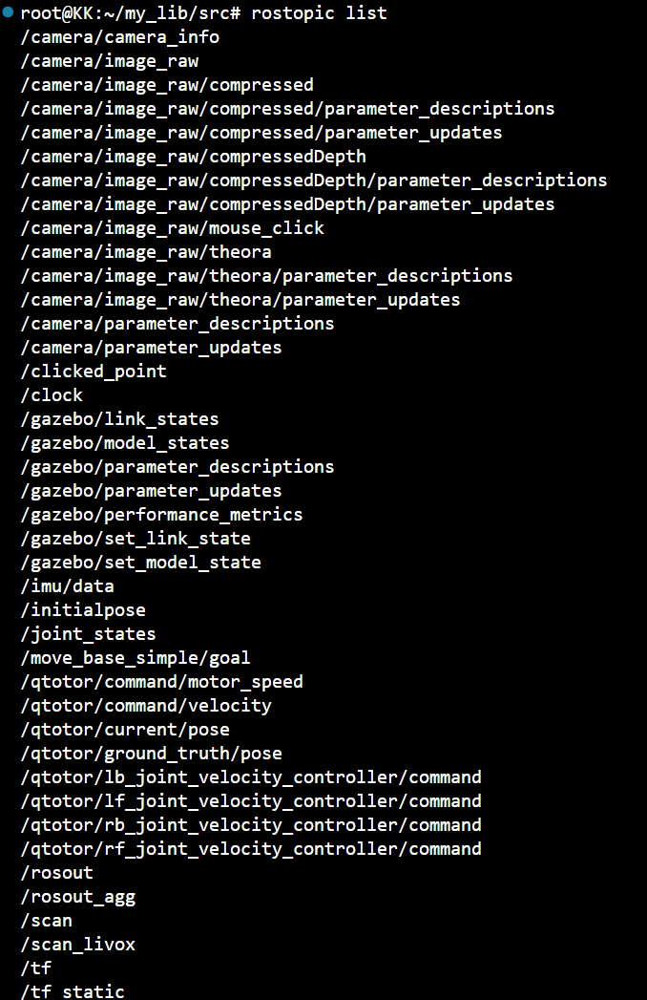

## 写在前面

本项目耗时七天，从solidworks导入了自定义四旋翼机体，添加了四个旋翼的电机，但考虑到考核难度，未引入升力，同时机体质心、转动惯量有微小误差，所以任务抛弃了3维控制，均是2维方向的任务。适合新手初次接触ros  
环境：Ubuntu20.04+Ros1 noetic+gazebo11  
下图是传感器配置：  

2d雷达（黑色）  
3d激光雷达mid360（灰色）  
camera（蓝色）  
imu（绿色）
# 安装方式
```
roscore
```
新开一个目录
```
mkdir catkin_ws  
cd catkin_ws
git clone https://github.com/iamgod-king/qtotor.git
```
把最外层文件夹改为src  
下面是正确的文件夹路径  
  
还没完，在catkin_ws目录下 
```
caktin_make
source devel/setup.bash
roslaunch qtotor qtotor.launch
```
gazebo加载慢，要多等待一会；会跳出下面<font color="#FF5" size="5">4</font>个界面  
<font size="4">Gazebo地图：  
 
mid360点云rviz：  
  
四旋翼机体和2D雷达点云rviz：  

关节node rviz:可以控制上图的机体的绿色桨叶转动：<font>  



下图是所有话题列表：  
  
## <font color="red">下面的话题介绍非常重要！</font>
/camera 下的所有话题 20hz，单目摄像头数据  
/scan 话题 10hz，2D雷达的点云数据  
/scan_livox 话题 10hz，mid360的点云数据  
/imu/data 话题 200hz，imu数据  
/qtotor/current/pose 和/qtotor/ground_truth/pose话题，发布当前机体的精准位置  
/qtotor/command/velocity 话题，订阅机体坐标系下的x、y方向速度和yaw角速度  
## 传感器坐标
mid360坐标(0 ,0 ,0.09)  
imu坐标----(0 ,0 ,0.02)  
2D雷达坐标(0 ,0 ,0.05)  
camera坐标(0.05 ,0 ,0.03)  
